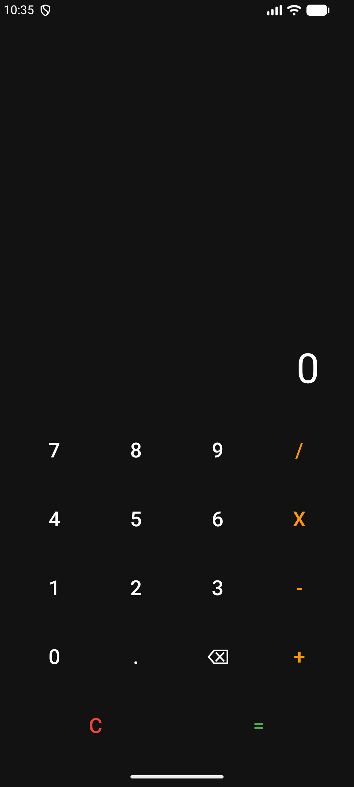

# Tutorial: Membangun Aplikasi Kalkulator Android

Modul ini adalah panduan teknis untuk membangun aplikasi kalkulator dengan antarmuka profesional (Dark Mode) dan logika kalkulasi yang dinamis.

---

## 1. Membuat Proyek Baru
1. Buka **Android Studio**.
2. Pilih **New Project** > **Empty Views Activity**.
3. Nama proyek: `kalkulator`, Bahasa: **Kotlin**.
4. Klik **Finish** dan tunggu proses sinkronisasi Gradle selesai.

## 2. Desain Antarmuka (`activity_calculator.xml`)
Menggunakan `GridLayout` dengan gaya *borderless* untuk memberikan tampilan modern dan bersih.

```xml
<?xml version="1.0" encoding="utf-8"?>
<!-- LinearLayout sebagai kontainer utama dengan orientasi vertikal -->
<LinearLayout xmlns:android="http://schemas.android.com/apk/res/android"
    android:layout_width="match_parent"
    android:layout_height="match_parent"
    android:orientation="vertical"
    android:padding="16dp"
    android:background="#121212">

    <!-- TextView: Layar tampilan untuk menunjukkan input angka dan hasil perhitungan -->
    <TextView
        android:id="@+id/tvDisplay"
        android:layout_width="match_parent"
        android:layout_height="0dp"
        android:layout_weight="1"
        android:background="@android:color/transparent"
        android:gravity="bottom|end"
        android:padding="24dp"
        android:text="0"
        android:textColor="#FFFFFF"
        android:textSize="48sp"
        android:maxLines="2"
        android:ellipsize="end" />

    <!-- GridLayout: Menyusun tombol-tombol kalkulator dalam bentuk tabel/grid -->
    <GridLayout
        android:layout_width="match_parent"
        android:layout_height="wrap_content"
        android:columnCount="4"
        android:rowCount="5"
        android:paddingBottom="16dp">

        <!-- Baris 1: Angka 7, 8, 9 dan Operasi Bagi (/) -->
        <Button android:id="@+id/btn7" android:text="7" style="?android:attr/borderlessButtonStyle" android:layout_width="0dp" android:layout_height="80dp" android:layout_columnWeight="1" android:textColor="#FFFFFF" android:textSize="24sp"/>
        <Button android:id="@+id/btn8" android:text="8" style="?android:attr/borderlessButtonStyle" android:layout_width="0dp" android:layout_height="80dp" android:layout_columnWeight="1" android:textColor="#FFFFFF" android:textSize="24sp"/>
        <Button android:id="@+id/btn9" android:text="9" style="?android:attr/borderlessButtonStyle" android:layout_width="0dp" android:layout_height="80dp" android:layout_columnWeight="1" android:textColor="#FFFFFF" android:textSize="24sp"/>
        <Button android:id="@+id/btnBagi" android:text="/" style="?android:attr/borderlessButtonStyle" android:layout_width="0dp" android:layout_height="80dp" android:layout_columnWeight="1" android:textColor="#FF9800" android:textSize="24sp"/>

        <!-- Baris 2: Angka 4, 5, 6 dan Operasi Kali (x) -->
        <Button android:id="@+id/btn4" android:text="4" style="?android:attr/borderlessButtonStyle" android:layout_width="0dp" android:layout_height="80dp" android:layout_columnWeight="1" android:textColor="#FFFFFF" android:textSize="24sp"/>
        <Button android:id="@+id/btn5" android:text="5" style="?android:attr/borderlessButtonStyle" android:layout_width="0dp" android:layout_height="80dp" android:layout_columnWeight="1" android:textColor="#FFFFFF" android:textSize="24sp"/>
        <Button android:id="@+id/btn6" android:text="6" style="?android:attr/borderlessButtonStyle" android:layout_width="0dp" android:layout_height="80dp" android:layout_columnWeight="1" android:textColor="#FFFFFF" android:textSize="24sp"/>
        <Button android:id="@+id/btnKali" android:text="x" style="?android:attr/borderlessButtonStyle" android:layout_width="0dp" android:layout_height="80dp" android:layout_columnWeight="1" android:textColor="#FF9800" android:textSize="24sp"/>

        <!-- Baris 3: Angka 1, 2, 3 dan Operasi Kurang (-) -->
        <Button android:id="@+id/btn1" android:text="1" style="?android:attr/borderlessButtonStyle" android:layout_width="0dp" android:layout_height="80dp" android:layout_columnWeight="1" android:textColor="#FFFFFF" android:textSize="24sp"/>
        <Button android:id="@+id/btn2" android:text="2" style="?android:attr/borderlessButtonStyle" android:layout_width="0dp" android:layout_height="80dp" android:layout_columnWeight="1" android:textColor="#FFFFFF" android:textSize="24sp"/>
        <Button android:id="@+id/btn3" android:text="3" style="?android:attr/borderlessButtonStyle" android:layout_width="0dp" android:layout_height="80dp" android:layout_columnWeight="1" android:textColor="#FFFFFF" android:textSize="24sp"/>
        <Button android:id="@+id/btnKurang" android:text="-" style="?android:attr/borderlessButtonStyle" android:layout_width="0dp" android:layout_height="80dp" android:layout_columnWeight="1" android:textColor="#FF9800" android:textSize="24sp"/>

        <!-- Baris 4: Angka 0, Koma (.), Hapus (⌫) dan Operasi Tambah (+) -->
        <Button android:id="@+id/btn0" android:text="0" style="?android:attr/borderlessButtonStyle" android:layout_width="0dp" android:layout_height="80dp" android:layout_columnWeight="1" android:textColor="#FFFFFF" android:textSize="24sp"/>
        <Button android:id="@+id/btnKoma" android:text="." style="?android:attr/borderlessButtonStyle" android:layout_width="0dp" android:layout_height="80dp" android:layout_columnWeight="1" android:textColor="#FFFFFF" android:textSize="24sp"/>
        <Button android:id="@+id/btnBack" android:text="⌫" style="?android:attr/borderlessButtonStyle" android:layout_width="0dp" android:layout_height="80dp" android:layout_columnWeight="1" android:textColor="#FFFFFF" android:textSize="24sp"/>
        <Button android:id="@+id/btnTambah" android:text="+" style="?android:attr/borderlessButtonStyle" android:layout_width="0dp" android:layout_height="80dp" android:layout_columnWeight="1" android:textColor="#FF9800" android:textSize="24sp"/>

        <!-- Baris 5: Tombol Clear (C) dan Samadengan (=) yang masing-masing memakan 2 kolom -->
        <Button android:id="@+id/btnClear" android:text="C" style="?android:attr/borderlessButtonStyle" android:layout_width="0dp" android:layout_height="80dp" android:layout_columnSpan="2" android:layout_columnWeight="1" android:textColor="#F44336" android:textSize="24sp"/>
        <Button android:id="@+id/btnSamaDengan" android:text="=" style="?android:attr/borderlessButtonStyle" android:layout_width="0dp" android:layout_height="80dp" android:layout_columnSpan="2" android:layout_columnWeight="1" android:textColor="#4CAF50" android:textSize="24sp"/>
    </GridLayout>
</LinearLayout>
```

## 3. Logika Pemrograman (`CalculatorActivity.kt`)
Logika utama menggunakan state management untuk memisahkan input angka dan operator matematika.

```kotlin
package com.example.kalkulator

import android.os.Bundle
import android.widget.Button
import android.widget.TextView
import androidx.appcompat.app.AppCompatActivity
import java.text.DecimalFormat

class CalculatorActivity : AppCompatActivity() {

    private var input1: String = ""
    private var input2: String = ""
    private var operasi: String = ""
    private val formatAngka = DecimalFormat("0.##")

    override fun onCreate(savedInstanceState: Bundle?) {
        super.onCreate(savedInstanceState)
        setContentView(R.layout.activity_calculator)

        val tvDisplay = findViewById<TextView>(R.id.tvDisplay)

        fun updateDisplay() {
            val tampilan = when {
                operasi.isEmpty() -> input1.ifEmpty { "0" }
                else -> "$input1 $operasi $input2"
            }
            tvDisplay.text = tampilan
        }

        fun performCalculation(): Double? {
            if (input1.isEmpty() || input2.isEmpty()) return null
            val n1 = input1.toDoubleOrNull() ?: 0.0
            val n2 = input2.toDoubleOrNull() ?: 0.0
            return when (operasi) {
                "+" -> n1 + n2
                "-" -> n1 - n2
                "x" -> n1 * n2
                "/" -> if (n2 != 0.0) n1 / n2 else null
                else -> null
            }
        }

        val tombolAngka = listOf(
            R.id.btn0 to "0", R.id.btn1 to "1", R.id.btn2 to "2", R.id.btn3 to "3",
            R.id.btn4 to "4", R.id.btn5 to "5", R.id.btn6 to "6", R.id.btn7 to "7",
            R.id.btn8 to "8", R.id.btn9 to "9"
        )

        for ((id, nilai) in tombolAngka) {
            findViewById<Button>(id).setOnClickListener {
                if (operasi.isEmpty()) input1 += nilai else input2 += nilai
                updateDisplay()
            }
        }

        findViewById<Button>(R.id.btnKoma).setOnClickListener {
            if (operasi.isEmpty() && !input1.contains(".")) input1 += "."
            else if (operasi.isNotEmpty() && !input2.contains(".")) input2 += "."
            updateDisplay()
        }

        findViewById<Button>(R.id.btnTambah).setOnClickListener { if(input1.isNotEmpty()) operasi = "+" ; updateDisplay() }
        findViewById<Button>(R.id.btnKurang).setOnClickListener { if(input1.isNotEmpty()) operasi = "-" ; updateDisplay() }
        findViewById<Button>(R.id.btnKali).setOnClickListener { if(input1.isNotEmpty()) operasi = "x" ; updateDisplay() }
        findViewById<Button>(R.id.btnBagi).setOnClickListener { if(input1.isNotEmpty()) operasi = "/" ; updateDisplay() }

        findViewById<Button>(R.id.btnBack).setOnClickListener {
            if (operasi.isNotEmpty() && input2.isNotEmpty()) input2 = input2.dropLast(1)
            else if (operasi.isNotEmpty()) operasi = ""
            else if (input1.isNotEmpty()) input1 = input1.dropLast(1)
            updateDisplay()
        }

        findViewById<Button>(R.id.btnClear).setOnClickListener {
            input1 = ""; input2 = ""; operasi = ""
            updateDisplay()
        }

        findViewById<Button>(R.id.btnSamaDengan).setOnClickListener {
            val hasil = performCalculation()
            if (hasil != null) {
                tvDisplay.text = formatAngka.format(hasil)
                input1 = hasil.toString()
                input2 = ""; operasi = ""
            } else {
                tvDisplay.text = "Error"
            }
        }
    }
}
```

## 4. Kesimpulan
Proyek ini mengajarkan prinsip dasar Android: **Layout Management** menggunakan `GridLayout` untuk antarmuka tombol yang kompleks dan **State Management** untuk menangani urutan input aritmatika secara dinamis.

## 5. Hasil
Aplikasi berhasil dibuat dengan dua layar: kalkulator dasar dan kalkulator lengkap. Setelah menekan tombol **Run**, Anda dapat melakukan perhitungan presisi tinggi dengan antarmuka yang profesional dan responsif.

