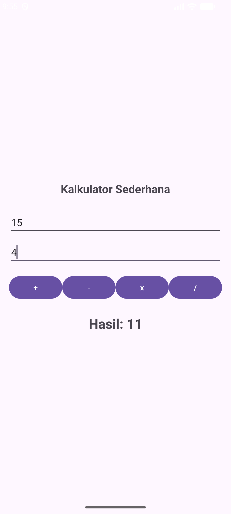
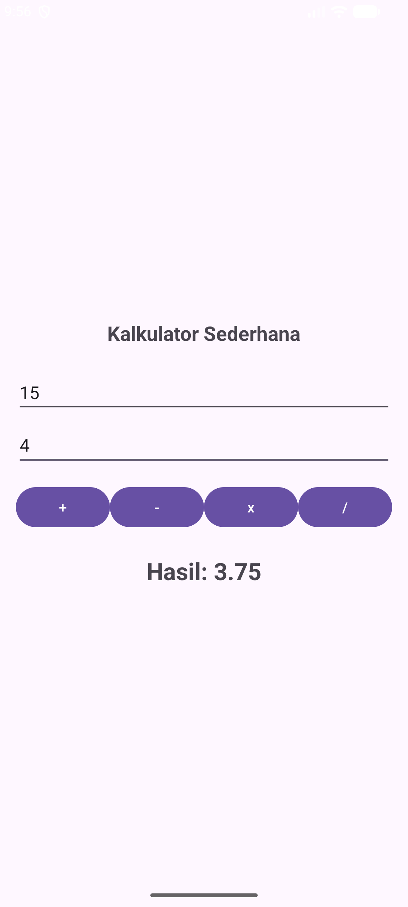
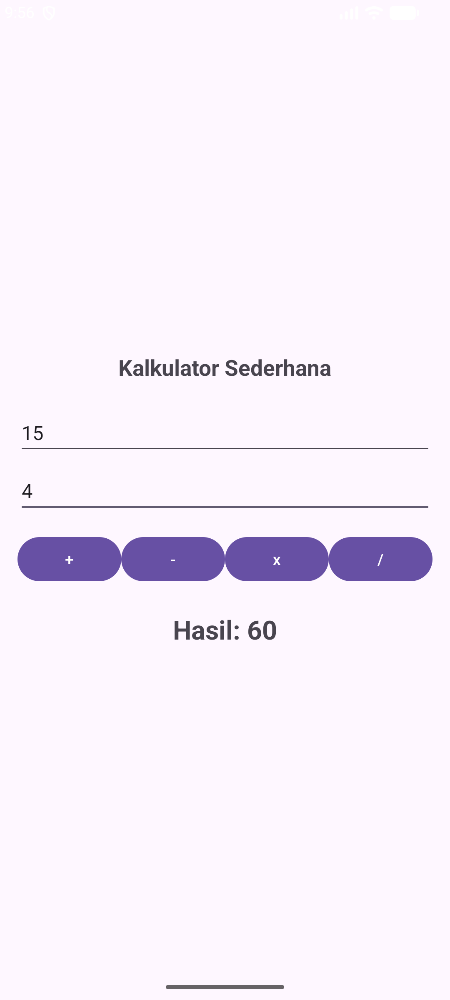

# Tutorial: Membangun Aplikasi Kalkulator Android

Modul ini memandu Anda dalam membuat aplikasi kalkulator dengan dua mode: Kalkulator Sederhana dan Kalkulator Lengkap.

## 1. Membuat Proyek Baru
1. Buka **Android Studio** > **New Project**.
2. Pilih **Empty Views Activity**.
3. Nama: `kalkulator`, Bahasa: **Kotlin**.
4. Tunggu sinkronisasi Gradle selesai.

## 2. Desain Antarmuka (`activity_main.xml`)
Kode untuk file `app/src/main/res/layout/activity_main.xml`:

```xml
<?xml version="1.0" encoding="utf-8"?>
<!-- LinearLayout sebagai kontainer utama dengan orientasi vertikal -->
<LinearLayout xmlns:android="http://schemas.android.com/apk/res/android"
    android:layout_width="match_parent"
    android:layout_height="match_parent"
    android:orientation="vertical"
    android:padding="16dp"
    android:gravity="center"
    android:id="@+id/main">

    <!-- Judul -->
    <TextView
        android:layout_width="wrap_content"
        android:layout_height="wrap_content"
        android:text="Kalkulator Sederhana"
        android:textSize="20sp"
        android:textStyle="bold"
        android:layout_marginBottom="24dp" />

    <!-- Input Bilangan 1 -->
    <EditText
        android:id="@+id/etBilangan1"
        android:layout_width="match_parent"
        android:layout_height="wrap_content"
        android:hint="Bilangan 1"
        android:inputType="numberDecimal" />

    <!-- Input Bilangan 2 -->
    <EditText
        android:id="@+id/etBilangan2"
        android:layout_width="match_parent"
        android:layout_height="wrap_content"
        android:hint="Bilangan 2"
        android:layout_marginTop="8dp"
        android:inputType="numberDecimal" />

    <!-- Baris Tombol Operasi -->
    <LinearLayout
        android:layout_width="match_parent"
        android:layout_height="wrap_content"
        android:orientation="horizontal"
        android:layout_marginTop="16dp">

        <Button android:id="@+id/btnTambah" android:layout_width="0dp" android:layout_height="wrap_content" android:layout_weight="1" android:text="+" />
        <Button android:id="@+id/btnKurang" android:layout_width="0dp" android:layout_height="wrap_content" android:layout_weight="1" android:text="-" />
        <Button android:id="@+id/btnKali" android:layout_width="0dp" android:layout_height="wrap_content" android:layout_weight="1" android:text="x" />
        <Button android:id="@+id/btnBagi" android:layout_width="0dp" android:layout_height="wrap_content" android:layout_weight="1" android:text="/" />
    </LinearLayout>

    <!-- Hasil Output -->
    <TextView
        android:id="@+id/tvHasil"
        android:layout_width="wrap_content"
        android:layout_height="wrap_content"
        android:layout_marginTop="24dp"
        android:text="Hasil: 0"
        android:textSize="24sp"
        android:textStyle="bold" />

    <!-- Tombol Pindah -->
    <Button
        android:id="@+id/btnPindah"
        android:layout_width="match_parent"
        android:layout_height="wrap_content"
        android:layout_marginTop="32dp"
        android:text="Buka Kalkulator Lengkap" />
</LinearLayout>
```

## 3. Logika Pemrograman (`MainActivity.kt`)
Kode untuk file `app/src/main/java/com/example/kalkulator/MainActivity.kt`:

```kotlin
package com.example.kalkulator

import android.content.Intent
import android.os.Bundle
import android.widget.Button
import android.widget.EditText
import android.widget.TextView
import androidx.appcompat.app.AppCompatActivity
import java.text.DecimalFormat

/**
 * MainActivity: Menangani Kalkulator Sederhana
 * Menyediakan dua input teks dan tombol operasi dasar.
 */
class MainActivity : AppCompatActivity() {

    override fun onCreate(savedInstanceState: Bundle?) {
        super.onCreate(savedInstanceState)
        setContentView(R.layout.activity_main)

        // Menghubungkan variabel dengan komponen di layout XML
        val etBilangan1 = findViewById<EditText>(R.id.etBilangan1)
        val etBilangan2 = findViewById<EditText>(R.id.etBilangan2)
        val btnTambah = findViewById<Button>(R.id.btnTambah)
        val btnKurang = findViewById<Button>(R.id.btnKurang)
        val btnKali = findViewById<Button>(R.id.btnKali)
        val btnBagi = findViewById<Button>(R.id.btnBagi)
        val tvHasil = findViewById<TextView>(R.id.tvHasil)
        val btnPindah = findViewById<Button>(R.id.btnPindah)

        // Format angka untuk membulatkan desimal maksimal 2 angka di belakang koma
        val formatAngka = DecimalFormat("0.##")

        /**
         * Fungsi hitung:
         * 1. Mengambil input dari EditText (Bilangan 1 dan 2)
         * 2. Melakukan validasi apakah input kosong atau tidak
         * 3. Melakukan perhitungan aritmatika (+, -, *, /)
         * 4. Menampilkan hasil terformat ke TextView (tvHasil)
         */
        fun hitung(operasi: String) {
            val bil1Str = etBilangan1.text.toString()
            val bil2Str = etBilangan2.text.toString()

            if (bil1Str.isEmpty() || bil2Str.isEmpty()) {
                tvHasil.text = "Masukkan angka!"
                return
            }

            val bil1 = bil1Str.toDouble()
            val bil2 = bil2Str.toDouble()
            var hasil = 0.0

            when (operasi) {
                "+" -> hasil = bil1 + bil2
                "-" -> hasil = bil1 - bil2
                "*" -> hasil = bil1 * bil2
                "/" -> {
                    if (bil2 != 0.0) {
                        hasil = bil1 / bil2
                    } else {
                        tvHasil.text = "Error: Bagi 0"
                        return
                    }
                }
            }
            tvHasil.text = "Hasil: ${formatAngka.format(hasil)}"
        }

        // Listener klik tombol
        btnTambah.setOnClickListener { hitung("+") }
        btnKurang.setOnClickListener { hitung("-") }
        btnKali.setOnClickListener { hitung("*") }
        btnBagi.setOnClickListener { hitung("/") }

        // Navigasi ke Kalkulator Lengkap
        btnPindah.setOnClickListener {
            val intent = Intent(this, CalculatorActivity::class.java)
            startActivity(intent)
        }
    }
}
```

## 4. Kesimpulan
Proyek ini mengajarkan prinsip dasar Android: **View Binding** (findViewById), **Intent** (navigasi), **Event Handling** (setOnClickListener), dan **Layout Management**. Anda kini memiliki fondasi kuat untuk mengembangkan aplikasi Android yang lebih kompleks!

## 5. Hasil
| Tambah | Kurang | Bagi | Kali |
| :---: | :---: | :---: | :---: |
|  |  |  |  |
