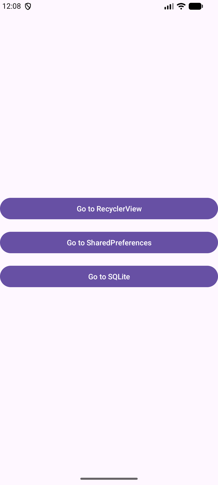
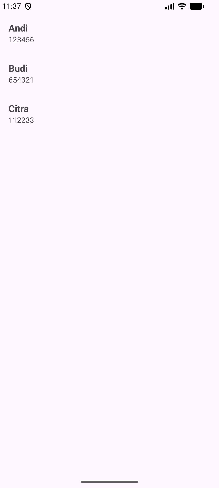
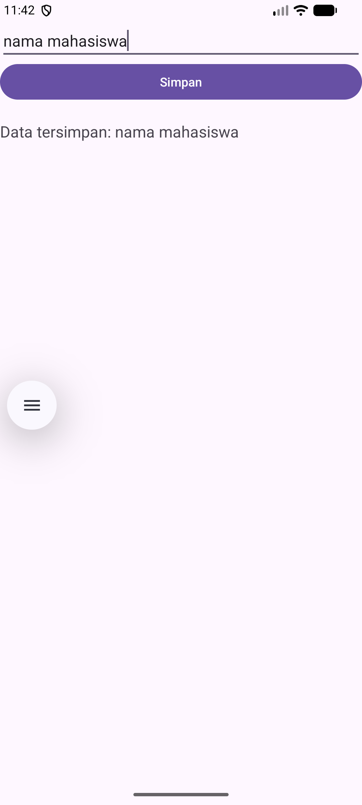
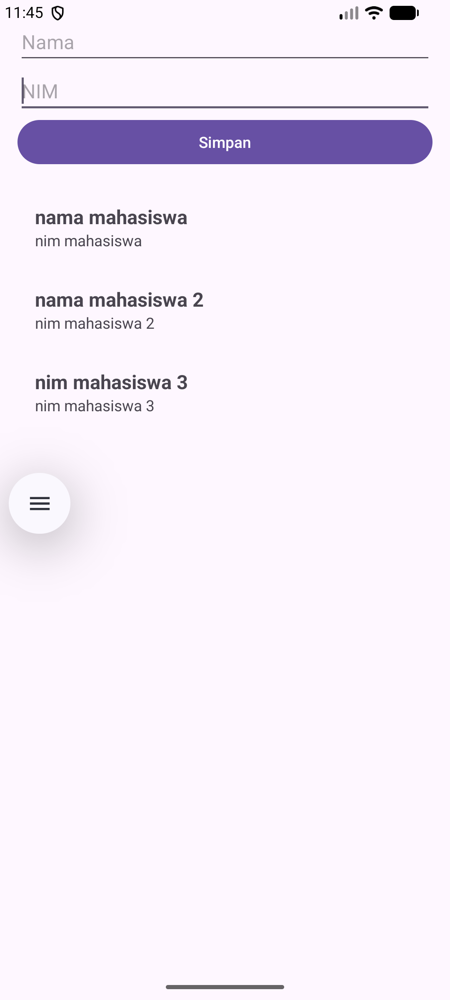

# Tutorial Android: Membuat Aplikasi Materi

Tutorial ini akan membimbing Anda membuat aplikasi Android dari awal hingga implementasi RecyclerView, SharedPreferences, dan SQLite.

## 1. Membuat Project Baru

Langkah-langkah membuat project di Android Studio:

1. Buka **Android Studio**.
2. Klik **New Project**.
3. Pilih template **Empty Views Activity**.
4. Isi detail project:
   - **Name**: `materi`
   - **Package name**: `com.example.materi`
   - **Language**: `Kotlin`
5. Klik **Finish**.

---

## 2. Layout Utama (MainActivity)

### File: `activity_main.xml`
Path: `app/src/main/res/layout/activity_main.xml`

```xml
<?xml version="1.0" encoding="utf-8"?>
<LinearLayout xmlns:android="http://schemas.android.com/apk/res/android"
    xmlns:app="http://schemas.android.com/apk/res-auto"
    xmlns:tools="http://schemas.android.com/tools"
    android:id="@+id/main"
    android:layout_width="match_parent"
    android:layout_height="match_parent"
    android:orientation="vertical"
    android:gravity="center"
    android:padding="16dp"
    tools:context=".MainActivity">

    <Button
        android:id="@+id/btnRecyclerView"
        android:layout_width="match_parent"
        android:layout_height="wrap_content"
        android:text="Go to RecyclerView" />

    <Button
        android:id="@+id/btnSharedPreferences"
        android:layout_width="match_parent"
        android:layout_height="wrap_content"
        android:text="Go to SharedPreferences"
        android:layout_marginTop="16dp"/>

    <Button
        android:id="@+id/btnSQLite"
        android:layout_width="match_parent"
        android:layout_height="wrap_content"
        android:text="Go to SQLite"
        android:layout_marginTop="16dp"/>

</LinearLayout>
```

### File: `MainActivity.kt`
Path: `app/src/main/java/com/example/materi/MainActivity.kt`

```kotlin
package com.example.materi

import android.content.Intent
import android.os.Bundle
import android.widget.Button
import androidx.activity.enableEdgeToEdge
import androidx.appcompat.app.AppCompatActivity
import androidx.core.view.ViewCompat
import androidx.core.view.WindowInsetsCompat

class MainActivity : AppCompatActivity() {
    override fun onCreate(savedInstanceState: Bundle?) {
        super.onCreate(savedInstanceState)
        enableEdgeToEdge()
        setContentView(R.layout.activity_main)
        
        ViewCompat.setOnApplyWindowInsetsListener(findViewById(R.id.main)) { v, insets ->
            val systemBars = insets.getInsets(WindowInsetsCompat.Type.systemBars())
            v.setPadding(systemBars.left, systemBars.top, systemBars.right, systemBars.bottom)
            insets
        }

        findViewById<Button>(R.id.btnRecyclerView).setOnClickListener {
             startActivity(Intent(this, RecyclerViewActivity::class.java))
        }

        findViewById<Button>(R.id.btnSharedPreferences).setOnClickListener {
             startActivity(Intent(this, SharedPreferences::class.java))
        }

        findViewById<Button>(R.id.btnSQLite).setOnClickListener {
             startActivity(Intent(this, SQLite::class.java))
        }
    }
}
```
<br>
---

## 3. Implementasi RecyclerView

### Cara Membuat Activity Baru:
1. Klik kanan pada package `com.example.materi`.
2. Pilih **New** -> **Activity** -> **Empty Views Activity**.
3. Beri nama `RecyclerViewActivity`.

### Model Data: `Mahasiswa.kt`
Path: `app/src/main/java/com/example/materi/Mahasiswa.kt`
```kotlin
package com.example.materi

data class Mahasiswa(val nama: String, val nim: String)
```

### Layout Item: `item_mahasiswa.xml`
Path: `app/src/main/res/layout/item_mahasiswa.xml`
```xml
<?xml version="1.0" encoding="utf-8"?>
<LinearLayout xmlns:android="http://schemas.android.com/apk/res/android"
    android:layout_width="match_parent"
    android:layout_height="wrap_content"
    android:orientation="vertical"
    android:padding="16dp">

    <TextView
        android:id="@+id/tvNama"
        android:layout_width="wrap_content"
        android:layout_height="wrap_content"
        android:textSize="18sp"
        android:textStyle="bold" />

    <TextView
        android:id="@+id/tvNim"
        android:layout_width="wrap_content"
        android:layout_height="wrap_content"
        android:textSize="14sp" />

</LinearLayout>
```

### Adapter: `MahasiswaAdapter.kt`
Path: `app/src/main/java/com/example/materi/MahasiswaAdapter.kt`
```kotlin
package com.example.materi

import android.view.LayoutInflater
import android.view.View
import android.view.ViewGroup
import android.widget.TextView
import androidx.recyclerview.widget.RecyclerView

class MahasiswaAdapter(private val daftarMahasiswa: List<Mahasiswa>) :
    RecyclerView.Adapter<MahasiswaAdapter.ViewHolder>() {

    class ViewHolder(view: View) : RecyclerView.ViewHolder(view) {
        val tvNama: TextView = view.findViewById(R.id.tvNama)
        val tvNim: TextView = view.findViewById(R.id.tvNim)
    }

    override fun onCreateViewHolder(parent: ViewGroup, viewType: Int): ViewHolder {
        val view = LayoutInflater.from(parent.context)
            .inflate(R.layout.item_mahasiswa, parent, false)
        return ViewHolder(view)
    }

    override fun onBindViewHolder(holder: ViewHolder, position: Int) {
        val mhs = daftarMahasiswa[position]
        holder.tvNama.text = mhs.nama
        holder.tvNim.text = mhs.nim
    }

    override fun getItemCount() = daftarMahasiswa.size
}
```

### Layout Activity: `activity_recycler_view.xml`
```xml
<?xml version="1.0" encoding="utf-8"?>
<androidx.constraintlayout.widget.ConstraintLayout xmlns:android="http://schemas.android.com/apk/res/android"
    xmlns:app="http://schemas.android.com/apk/res-auto"
    xmlns:tools="http://schemas.android.com/tools"
    android:id="@+id/main"
    android:layout_width="match_parent"
    android:layout_height="match_parent"
    tools:context=".RecyclerViewActivity">

    <androidx.recyclerview.widget.RecyclerView
        android:id="@+id/rvMahasiswa"
        android:layout_width="match_parent"
        android:layout_height="match_parent"
        app:layout_constraintTop_toTopOf="parent"
        app:layout_constraintBottom_toBottomOf="parent"
        app:layout_constraintStart_toStartOf="parent"
        app:layout_constraintEnd_toEndOf="parent" />

</androidx.constraintlayout.widget.ConstraintLayout>
```

### Kode Activity: `RecyclerView.kt`
Path: `app/src/main/java/com/example/materi/RecyclerView.kt`
```kotlin
package com.example.materi

import android.os.Bundle
import androidx.activity.enableEdgeToEdge
import androidx.appcompat.app.AppCompatActivity
import androidx.core.view.ViewCompat
import androidx.core.view.WindowInsetsCompat
import androidx.recyclerview.widget.LinearLayoutManager
import androidx.recyclerview.widget.RecyclerView

class RecyclerViewActivity : AppCompatActivity() {
    override fun onCreate(savedInstanceState: Bundle?) {
        super.onCreate(savedInstanceState)
        enableEdgeToEdge()
        setContentView(R.layout.activity_recycler_view)

        val rvMahasiswa = findViewById<RecyclerView>(R.id.rvMahasiswa)
        
        val data = listOf(
            Mahasiswa("Andi", "123456"),
            Mahasiswa("Budi", "654321"),
            Mahasiswa("Citra", "112233")
        )

        rvMahasiswa.layoutManager = LinearLayoutManager(this)
        rvMahasiswa.adapter = MahasiswaAdapter(data)

        ViewCompat.setOnApplyWindowInsetsListener(findViewById(R.id.main)) { v, insets ->
            val systemBars = insets.getInsets(WindowInsetsCompat.Type.systemBars())
            v.setPadding(systemBars.left, systemBars.top, systemBars.right, systemBars.bottom)
            insets
        }
    }
}
```
<br>
---

## 4. Implementasi SharedPreferences

### Cara Membuat Activity Baru:
1. Klik kanan pada package `com.example.materi`.
2. Pilih **New** -> **Activity** -> **Empty Views Activity**.
3. Beri nama `SharedPreferences`.

### Layout: `activity_shared_preferences.xml`
Path: `app/src/main/res/layout/activity_shared_preferences.xml`
```xml
<?xml version="1.0" encoding="utf-8"?>
<LinearLayout xmlns:android="http://schemas.android.com/apk/res/android"
    android:id="@+id/main"
    android:layout_width="match_parent"
    android:layout_height="match_parent"
    android:orientation="vertical"
    android:padding="16dp">

    <EditText
        android:id="@+id/etInput"
        android:layout_width="match_parent"
        android:layout_height="wrap_content"
        android:hint="Masukkan teks" />

    <Button
        android:id="@+id/btnSave"
        android:layout_width="match_parent"
        android:layout_height="wrap_content"
        android:text="Simpan" />

    <TextView
        android:id="@+id/tvHasil"
        android:layout_width="match_parent"
        android:layout_height="wrap_content"
        android:layout_marginTop="20dp"
        android:text="Data tersimpan: -"
        android:textSize="18sp" />

</LinearLayout>
```

### Kode Activity: `SharedPreferences.kt`
Path: `app/src/main/java/com/example/materi/SharedPreferences.kt`
```kotlin
package com.example.materi

import android.content.Context
import android.os.Bundle
import android.widget.Button
import android.widget.EditText
import android.widget.TextView
import androidx.activity.enableEdgeToEdge
import androidx.appcompat.app.AppCompatActivity
import androidx.core.view.ViewCompat
import androidx.core.view.WindowInsetsCompat

class SharedPreferences : AppCompatActivity() {

    private val PREFS_NAME = "MyPrefs"
    private val KEY_DATA = "saved_data"

    override fun onCreate(savedInstanceState: Bundle?) {
        super.onCreate(savedInstanceState)
        enableEdgeToEdge()
        setContentView(R.layout.activity_shared_preferences)

        val etInput = findViewById<EditText>(R.id.etInput)
        val btnSave = findViewById<Button>(R.id.btnSave)
        val tvHasil = findViewById<TextView>(R.id.tvHasil)

        val sharedPreferences = getSharedPreferences(PREFS_NAME, Context.MODE_PRIVATE)

        // Load data tersimpan saat activity dibuka
        val savedData = sharedPreferences.getString(KEY_DATA, "-")
        tvHasil.text = "Data tersimpan: $savedData"

        btnSave.setOnClickListener {
            val inputText = etInput.text.toString()
            
            // Simpan ke SharedPreferences
            sharedPreferences.edit().putString(KEY_DATA, inputText).apply()
            
            // Update tampilan
            tvHasil.text = "Data tersimpan: $inputText"
        }

        ViewCompat.setOnApplyWindowInsetsListener(findViewById(R.id.main)) { v, insets ->
            val systemBars = insets.getInsets(WindowInsetsCompat.Type.systemBars())
            v.setPadding(systemBars.left, systemBars.top, systemBars.right, systemBars.bottom)
            insets
        }
    }
}
```
<br>
---

## 5. Implementasi SQLite

### Cara Membuat Activity Baru:
1. Klik kanan pada package `com.example.materi`.
2. Pilih **New** -> **Activity** -> **Empty Views Activity**.
3. Beri nama `SQLite`.

### Database Helper: `DatabaseHelper.kt`
Path: `app/src/main/java/com/example/materi/DatabaseHelper.kt`
```kotlin
package com.example.materi

import android.content.ContentValues
import android.content.Context
import android.database.sqlite.SQLiteDatabase
import android.database.sqlite.SQLiteOpenHelper

class DatabaseHelper(context: Context) : SQLiteOpenHelper(context, "Mahasiswa.db", null, 1) {

    override fun onCreate(db: SQLiteDatabase) {
        db.execSQL("CREATE TABLE mahasiswa (id INTEGER PRIMARY KEY AUTOINCREMENT, nama TEXT, nim TEXT)")
    }

    override fun onUpgrade(db: SQLiteDatabase, oldVersion: Int, newVersion: Int) {
        db.execSQL("DROP TABLE IF EXISTS mahasiswa")
        onCreate(db)
    }

    fun insertMahasiswa(nama: String, nim: String) {
        val db = writableDatabase
        val values = ContentValues().apply {
            put("nama", nama)
            put("nim", nim)
        }
        db.insert("mahasiswa", null, values)
        db.close()
    }

    fun getAllMahasiswa(): List<Mahasiswa> {
        val list = mutableListOf<Mahasiswa>()
        val db = readableDatabase
        val cursor = db.rawQuery("SELECT * FROM mahasiswa", null)
        if (cursor.moveToFirst()) {
            do {
                list.add(Mahasiswa(cursor.getString(1), cursor.getString(2)))
            } while (cursor.moveToNext())
        }
        cursor.close()
        db.close()
        return list
    }
}
```

### Layout: `activity_sqlite.xml`
Path: `app/src/main/res/layout/activity_sqlite.xml`
```xml
<?xml version="1.0" encoding="utf-8"?>
<LinearLayout xmlns:android="http://schemas.android.com/apk/res/android"
    android:id="@+id/main"
    android:layout_width="match_parent"
    android:layout_height="match_parent"
    android:orientation="vertical"
    android:padding="16dp">

    <EditText
        android:id="@+id/etNama"
        android:layout_width="match_parent"
        android:layout_height="wrap_content"
        android:hint="Nama" />

    <EditText
        android:id="@+id/etNim"
        android:layout_width="match_parent"
        android:layout_height="wrap_content"
        android:hint="NIM" />

    <Button
        android:id="@+id/btnSimpan"
        android:layout_width="match_parent"
        android:layout_height="wrap_content"
        android:text="Simpan" />

    <androidx.recyclerview.widget.RecyclerView
        android:id="@+id/rvMahasiswaSQLite"
        android:layout_width="match_parent"
        android:layout_height="match_parent"
        android:layout_marginTop="16dp" />

</LinearLayout>
```

### Kode Activity: `SQLite.kt`
Path: `app/src/main/java/com/example/materi/SQLite.kt`
```kotlin
package com.example.materi

import android.os.Bundle
import android.widget.Button
import android.widget.EditText
import androidx.activity.enableEdgeToEdge
import androidx.appcompat.app.AppCompatActivity
import androidx.recyclerview.widget.LinearLayoutManager
import androidx.recyclerview.widget.RecyclerView

class SQLite : AppCompatActivity() {

    private lateinit var dbHelper: DatabaseHelper
    private lateinit var adapter: MahasiswaAdapter
    private var listMahasiswa = mutableListOf<Mahasiswa>()

    override fun onCreate(savedInstanceState: Bundle?) {
        super.onCreate(savedInstanceState)
        enableEdgeToEdge()
        setContentView(R.layout.activity_sqlite)

        dbHelper = DatabaseHelper(this)

        val etNama = findViewById<EditText>(R.id.etNama)
        val etNim = findViewById<EditText>(R.id.etNim)
        val btnSimpan = findViewById<Button>(R.id.btnSimpan)
        val rvMahasiswa = findViewById<RecyclerView>(R.id.rvMahasiswaSQLite)

        // Load awal
        listMahasiswa.addAll(dbHelper.getAllMahasiswa())
        adapter = MahasiswaAdapter(listMahasiswa)
        rvMahasiswa.layoutManager = LinearLayoutManager(this)
        rvMahasiswa.adapter = adapter

        btnSimpan.setOnClickListener {
            val nama = etNama.text.toString()
            val nim = etNim.text.toString()

            if (nama.isNotEmpty() && nim.isNotEmpty()) {
                dbHelper.insertMahasiswa(nama, nim)
                
                // Refresh data
                listMahasiswa.clear()
                listMahasiswa.addAll(dbHelper.getAllMahasiswa())
                adapter.notifyDataSetChanged()
                
                etNama.text.clear()
                etNim.text.clear()
            }
        }
    }
}
```
<br>
---

## 6. Menjalankan Aplikasi (Run)

1. Pastikan Emulator atau Device fisik terhubung.
2. Klik tombol **Run** (ikon segitiga hijau) di Android Studio.
3. Gunakan tombol di halaman utama untuk berpindah antar materi (RecyclerView, SharedPreferences, SQLite).
